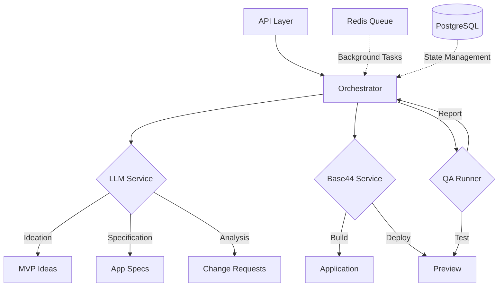

# Toolkit 🛠️

> An autonomous system that leverages LLMs to design, build, and test web applications with continuous quality assurance.

<div align="center">

[](https://fastapi.tiangolo.com)
[](https://www.python.org)
[](https://www.postgresql.org)
[](https://www.docker.com)

</div>

## What is This Repository?

The Toolkit project is an innovative autonomous development system that combines:
- 🤖 **LLM-Driven Development**: Automated application design and specification generation
- 🏗️ **Base44 Integration**: Seamless deployment and build management
- 🧪 **Automated QA**: Continuous testing and quality assurance
- 🔄 **Iterative Improvement**: Self-correcting development cycle

### Architecture Overview



### Key Features
- 🎯 Automated MVP generation from high-level criteria
- 🔄 Self-improving through iterative development
- 📊 Comprehensive testing and quality assurance
- 🚀 Scalable architecture with background processing
- 🔍 Detailed logging and monitoring

## Prerequisites
- Python 3.8+
- PostgreSQL 16
- Docker and Docker Compose
- Redis (included in Docker setup)

## Quick Start

1. **Setup Environment**
   ```bash
   # Create and activate virtual environment
   python -m venv .venv
   .\.venv\Scripts\Activate.ps1  # Windows
   source .venv/bin/activate     # Unix/MacOS

   # Install dependencies
   pip install -r requirements.txt
   ```

2. **Configure Environment**
   ```bash
   cp .env.example .env
   # Edit .env with your:
   # - OpenAI API key
   # - Base44 credentials
   # - Database settings (if not using default)
   ```

3. **Run Services**
   ```bash
   docker compose up --build -d
   ```

4. **Access Services**
   - API Documentation: http://localhost:8000/docs
   - PostgreSQL: localhost:5433
   - Redis: localhost:6379

## Architecture

### Components
- **FastAPI Backend** (`app/main.py`)
  - REST API for campaign management
  - Webhook endpoints for build notifications
  
- **Service Layer** (`app/services/`)
  - `orchestrator.py`: Main workflow coordinator
  - `llm_client.py`: OpenAI API integration
  - `base44_client.py`: Base44 platform integration
  - `qa_runner.py`: Automated testing framework

- **Data Layer** (`app/models/`)
  - PostgreSQL database
  - SQLAlchemy ORM
  - Pydantic schemas

- **Background Processing** (`worker/`)
  - Celery tasks
  - Redis message broker

## API Flow
1. `POST /campaigns`  → Creates MVP criteria & starts the loop
2. Base44 callback   → `POST /webhooks/builds/complete`
3. Worker runs QA    → Success: archive; Failure: generate Change Request and iterate

## Development Notes
- Local development uses stubbed external services by default
- Replace stubs in `services/llm_client.py` and `services/base44_client.py` for production
- Maximum 3 iterations per campaign (configurable)
- Logging via `loguru` in `app/utils/logging.py`

## Environment Variables
```ini
DATABASE_URL=postgresql+psycopg2://toolkit:toolkit@db:5432/toolkit
REDIS_URL=redis://redis:6379/0
LLM_PROVIDER=openai
LLM_API_KEY=your_key_here
BASE44_API_URL=https://app.base44.com/api
BASE44_API_KEY=your_key_here
ENV=dev
```

## Testing and Quality Assurance

### Integration Testing
- 🎭 Playwright integration (optional) for end-to-end testing
- 🔄 Automated test execution via QA runner
- 🧪 Comprehensive test suite templates

### Local Development
- 🔧 Stub responses for rapid development
- 📝 Detailed logging for debugging
- 🚀 Hot-reload enabled for API changes

## Contributing

We welcome contributions! Please follow these steps:

1. Fork the repository
2. Create a feature branch (`git checkout -b feature/amazing-feature`)
3. Commit your changes (`git commit -m 'Add amazing feature'`)
4. Push to the branch (`git push origin feature/amazing-feature`)
5. Open a Pull Request

### Development Guidelines
- Follow [PEP 8](https://peps.python.org/pep-0008/) style guide
- Add tests for new features
- Update documentation as needed
- Keep commits atomic and well-described

## Security

### Best Practices
- ⚠️ Never commit API keys or credentials
- 🔐 Use environment variables for sensitive data
- 🔄 Rotate secrets regularly
- 📦 Keep dependencies updated


